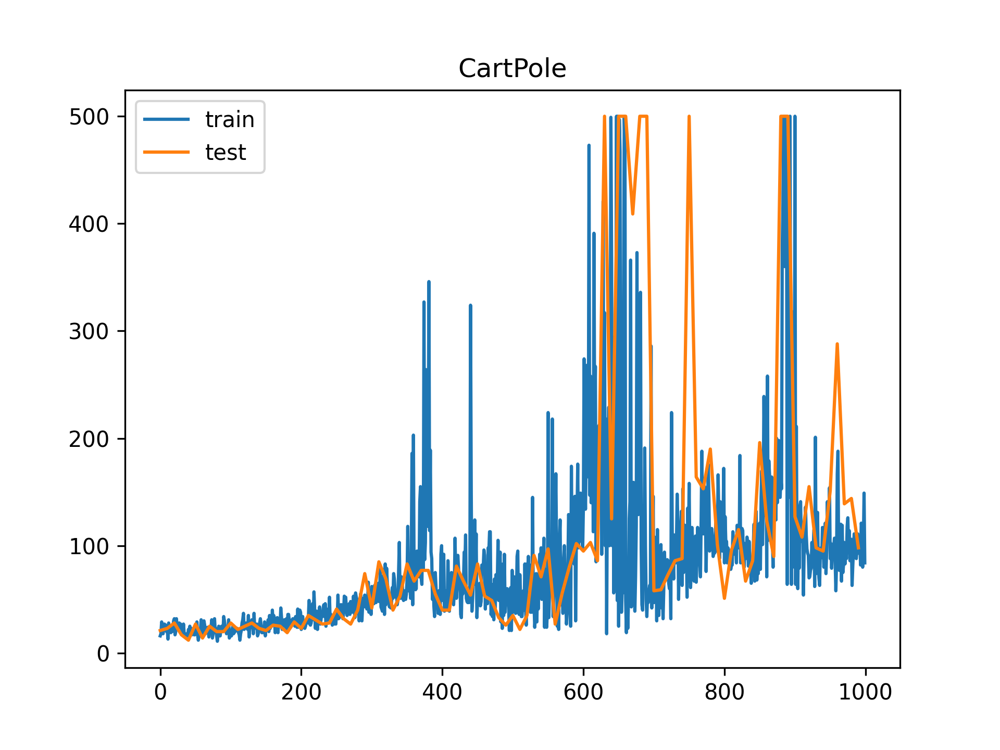
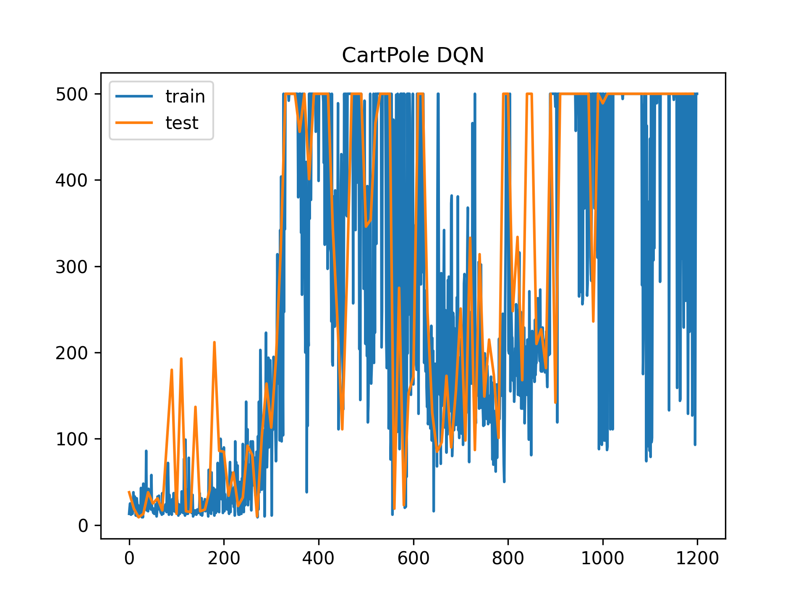
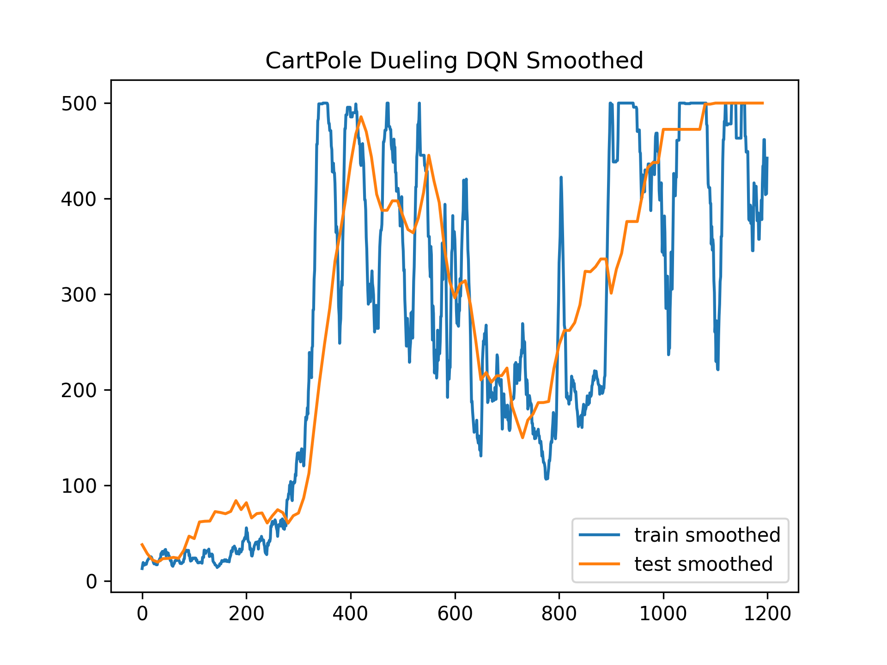

# CartPole

## 补全网络结构

```python
# 输入样本Batch，训练模型
def learn(self, samples: SampleBatchNumpy):
    '''
    samples需要包含字段: obs, next_obs, action, reward, done
    '''
    samples = samples.to_torch(device = self.device)
    # 计算Q(s, a)
    q_values = self.model.inference(samples.obs)
    # shape of q_value: [samples_num, 1]
    q_value = q_values.gather(1, samples.action)  # 此处需补全代码
    # 计算Q(s', a)
    next_q_values = self.model.inference(samples.next_obs)
    max_next_q_value = next_q_values.max(1, keepdim=True)[0]  # 此处需补全代码
    # Q函数更新目标 
    # 理想情况下, q_target: [samples_num, 1]
    q_target = samples.reward + self.gamma * max_next_q_value * (1 - samples.done)  # 此处需补全代码
    loss = F.mse_loss(q_value, q_target) # 此处需补全代码
    # 模型更新
    self.model.train(loss)
```

代码补充如上，按讲义上的步骤设计的DQA算法

> 补全网络后, 训练时CartPole上的表现如下，发现**震荡**，**不稳定**



----

### 调整参数如下

```python
conf = dict(
    action_dim = action_dim,
    epsilon_start = 1.0,
    epsilon_end = 0.02,
    epsilon_decay = 300,
    gamma = 0.99,
    device = 'cpu'
)
...
model = QNetwork(state_dim, action_dim, lr = 3e-4)
...
buffer_size = 2000
batch_size = 64
episodes = 1200
```

选用了衰减性的epsilon贪心，同时更改学习率和超参数，最终结果如下（第一张图是初始表现，第二张图是平均表现）






---

可以明显地发现，虽然仍有震荡的情形发生，但经过1200轮训练之后已经可以稳定跑满500步。

